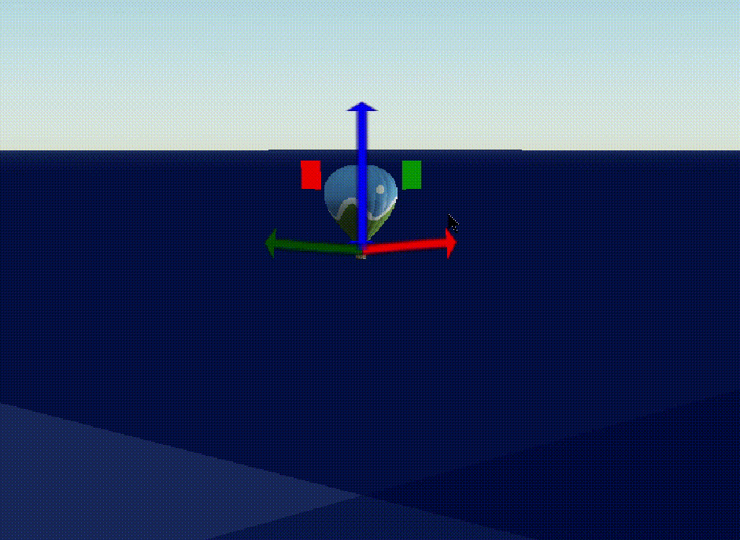
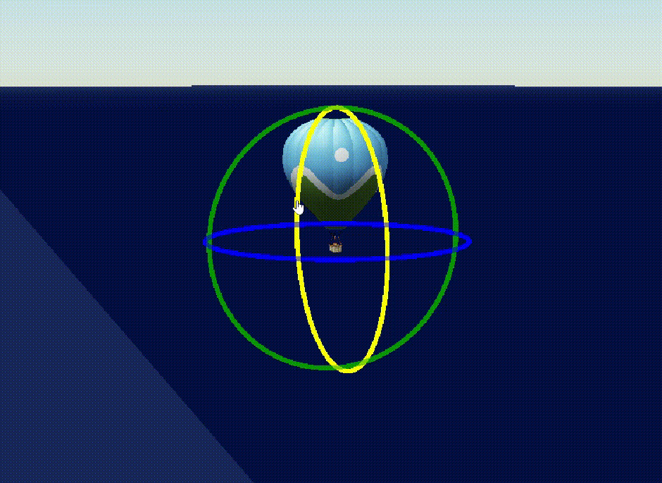
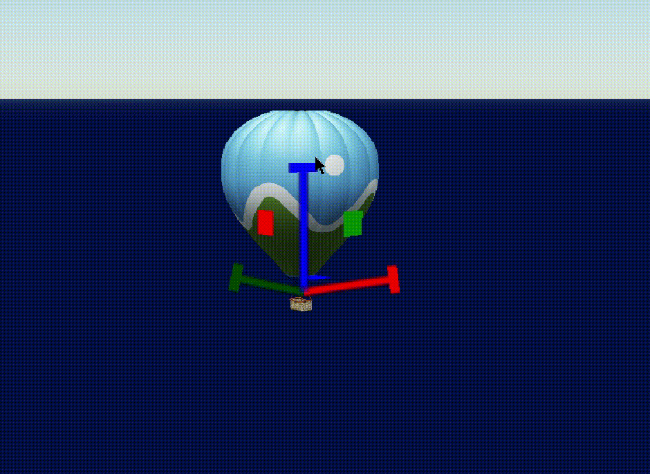
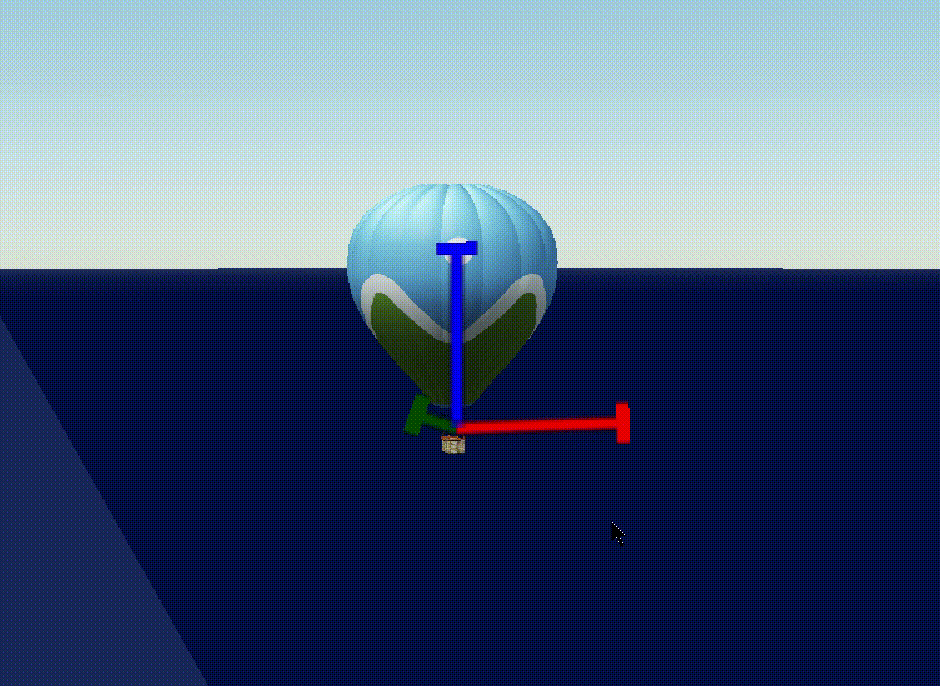

# cesium-gizmo

I wrote this gizmo to firgure out the model matrix calculations and to get familiar with the usage of DrawCommand in Cesium.

Versions higher than Cesium-1.101 are not supported.

Run `npm run start` to view the demo.

## Previews

### Translate


### Rotate


### Scale


### Uniform Scale


## Usage
```
import CesiumGizmo from 'file_path';

const gizmo = new CesiumGizmo(viewer, {
  mode: CesiumGizmo.Mode.ROTATE,
  onDragMoving: ({type, result}) => {
    console.log(result);
  }
});
```

## Documentation

```viewer```

The Cesiumer viewer object.


```options.item```

The item to apply the gizmo, optional. If assgined, it must have _modelMatrix_ attribute. So if you want to use it with a model, it should be created by _Model.fromGltf_.


```options.mode```

The mode of the gizmo, translate, rotate or scale, optional. Default is ```CesiumGizmo.Mode.TRANSLATE```.

```onDragMoving```

The callback function excuted when dragging the item, optional. The callback parameter has a ```type```, representing the gizmo mode, and a ```result```, which is the ```Cartesian3``` position of the item in translate mode, the ```HeadingPitchRoll``` value in rotate mode and an array of three dimensions' scale value in scale mode.

```options.length```

The length of the axes in pixels, optional. Default is ```300```.

```options.width```

The length of the axes in pixels, optional. Default is ```10```.

```options.xColor```

Color for the x axis, optional. Default is ```Cesium.Color.RED```.

```options.yColor```

Color for the y axis, optional. Default is ```Cesium.Color.GREEN```.

```optioins.zColor```

Color for the z axis, optional. Default is ```Cesium.Color.BLUE```.

```options.highlightColor```

Color for the axis highlighted, optional. Default is  ```Cesium.Color.YELLOW```.

```options.show```

The visibility of the gizmo, optional. Default is ```true```.

```applyTransformation```

Whether to apply the transformation on the item, optional. Default is ```true```.

## Precautions
* The item to apply the gizmo must have _modelMatrix_ attribute. So if you want to use it with a model, it should be created by _Model.fromGltf_.
* The transformation axes to the item's local space in the rotate and scale mode.
* The shaders are written in WebGL 1.0 so versions versions higher than Cesium-1.101 are not supported. 


